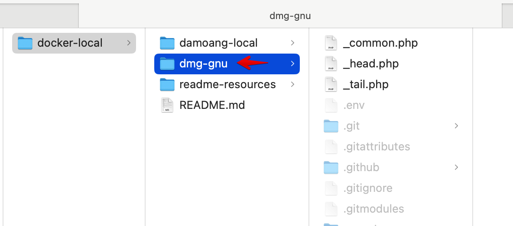
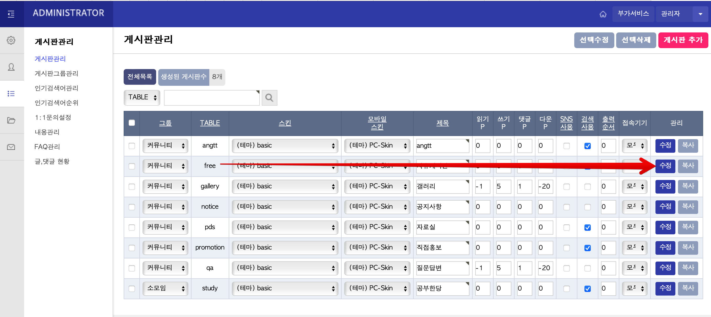
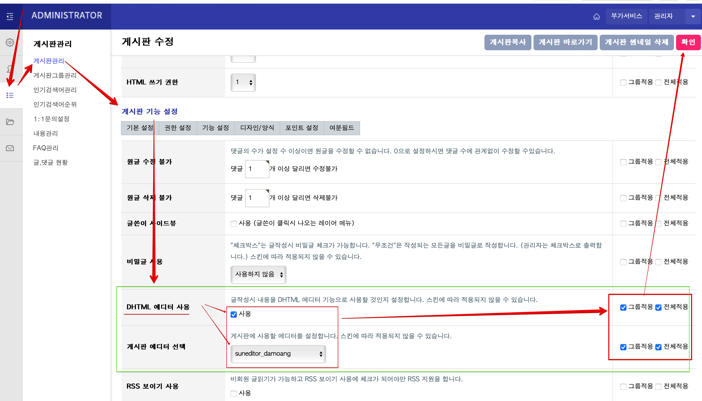
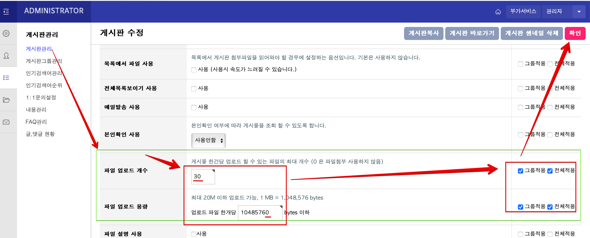

# 다모앙 로컬 개발 환경
본 레포지토리는 로컬 컴퓨터에 그누보드 개발환경을 구성하기위한 컨테이너를 조합하는 레파지토리입니다 (실 서버용 컨테이너 아님). 본래 `www`라는 이름이어야할 웹 루트 폴더명은 다모앙 git 레파지토리의 폴더에 맞추어 `dmg-gnu`로 정하였음을 미리 알립니다.

본 레포지토리는 다음 컨테이너 묶음 환경을 구성합니다.
* PHP 와 Composer
* NginX 와 그누보드 라우트 설정
* MySQL과 `gnuboad` db (데이터는 없음) 
* phpMyAdmin 데이터베이스 관리도구 웹앱

#### 개발환경 다운로드
php 개발환경을 구성할 뿐인 본 레포지토리의 도커파일등에대해 직접 기여할 게 아니라면(개발환경을 바꿀게 아니라면) 본 레포지토리는 클론하지말고 단순히 <strong>다운로드</strong> 받아 사용하도록 하고, 아래에 안내대로 `dmg-gnu` 레포지토리만 클론하여 사용하십시오. 
> [!CAUTION] 
> #### Nested Git Ropos
> 본 레포지토리를 '다운로드'가 아닌, 'Clone'하고 아래 설명대로 한다면 로컬폴더는 본 레포지토리 안에 dmg-gnu 레포지토리가 존재하는 nested repository(git 서브 모듈) 상태가 됩니다. 작업할 때 IDE 혹은 Code Editor는 둘 모두 인식할 것입니다. 이런 경우라면 레포를 잘 구분하여 작업(커밋)하시기 바랍니다.

## ◽ Docker 컨테이너 컴포즈로 시작하기

본 레포지토리를 다운로드 받은 폴더 안에 `damoang-local` 폴더가 있습니다.  CLI(터미널,cmd)에서 이 폴더로 이동해서 `start.sh` 쉘스크립트 파일을 실행하거나, 아래의 `docker-compose` 명령어를 직접 실행합니다.   

```
$ cd /경로/damoang-local
$ docker-compose up -d
```
완료되면 다음 이미지로 이루어진 도커 컨테이너가 실행됩니다. 

확인 명령어: $`docker ps`
 * da_nginx (80번포트)
 * da_php
 * da_mysql
 * da_phpmyadmin (8080포트)

 ### phpMyAdmin
MySQL DB를 웹브라우저환경에서 수정할 수 있는 phpMyAdmin 도커 이미지가 8080포트로 포함되어있습니다. `http://localhost:8080`으로 접속하면 phpMyAdmin을 이용할 수 있습니다. 패스워드는 MySQL 컨테이너와 같으며 다음 중 하나로 입력해 사용하면됩니다.

* ID: `root`, PW: `root123`
* ID: `user`, PW: `1234` 
 
## ◽ 다모앙 설치 및 설정 안내
이하 설치안내는 다모앙 그누보드 `dmg-gnu` [레포지토리]( https://github.com/damoang/dmg-gnu)(멤버-only 레포지토리)를 기준으로 설명합니다

## ◽ 그누보드 코어파일 설치
서버환경과는 다른 DB 설정을 갖으므로 먼저 그누보드 코어 1회 설치를 통해 로컬 컨테이너의 MySQL 정보를 생성해 주어야합니다.

### 1) 그누보드 코어파일 설치
도커 환경구성 후 생성되는 `dmg-gnu` 폴더는 NginX 80포트가 가리키는 Web Document root 입니다. `dmg-gnu`폴더 안에 그누보드 코어파일 내용물을 넣어 그누보드를 설치를 시작할 수 있습니다.

> 현재 다모앙에서 사용중인 그누보드 코어 버전을 안내받아 https://sir.kr/g5_pds/7170 에서 다운로드 받고 `dmg-gnu`폴더에 그누보드 코어 내용물을 복사해 넣습니다. 

### 2) `data` 폴더 생성
 설치과정 전에 `dmg-gnu`폴더에는 편집가능한 `data` 폴더가 존재해야합니다. 
`dmg-gnu` 폴더에 `data` 폴더를 생성하고 폴더권한을 777로 설정해줍니다 (컴퓨터사용자계정 누구나 읽기/실행/쓰기).
~~~
$ cd /경로/dmg-gnu
$ mkdir data
$ chmod 777 /경로/dmg-gnu/data
~~~

### 그누보드 기본버전 설치과정 시작
http://localhost 로 접속한 후 안내에따라 그누보드를 설치합니다. DB 설정정보에서 Mysql부분은 아래 정보대로 입력하고 최고관리자 정보는 사용자가 입력합니다  

* 그누보드 DB 설정 정보 (Host 이름에 주의.)
```
<Mysql 정보입력>

Host : da_mysql
User : user 
Password : 1234
DB : gnuboard
```
```
쇼핑몰 설치 : 체크해제
```
```
<최고관리자 정보입력>
회원ID : <사용자 입력>
비밀번호 : <사용자 입력>
이름 : <사용자 입력>
E-mail : <사용자 입력>
```
그누보드가 성공적으로 설치되면 80번 포트인 `http://localhost` 에 접속하여 그누보드 코어 기본 테마의 모습을 볼 수 있습니다.


### `data` 폴더 백업 후 그누보드 코어 기본 파일 삭제
`data` 폴더를 별도로 백업해두고 `dmg-gnu`폴더 채 삭제합니다.

## ◽ 다모앙 그누보드(dmg-gnu) 설치 및 `data` 폴더 포함
1. 다모앙 그누보드 `dmg-gnu` [레포지토리]( https://github.com/damoang/dmg-gnu)를 자신의 GitHub 계정으로 fork하고 해당 fork버전을 로컬컴퓨터에 클론하면 나오는 `dmg-gnu`폴더를 `docker-local` 하위에 넣어줍니다.
   -

2. 백업해두었던 `data` 폴더 또한  `dmg-gnu` 폴더 안에 다시 추가합니다.

    > [!CAUTION]
    > `data` 폴더는 다모앙 테마 레포지토리에서 .gitignore에 등록되어있으므로 git으로 관리 되지 않습니다.

3. `damoang-local` 폴더안에서 docker를 재시작합니다. 
    * $ `cd /경로/damoang-local`
    * $ `docker-compose restart`
4. `http://localhost`로 접속하면 그누보드 코어 기본 테마를 다시 볼 수 있습니다. 
5. 그누보드 코어 최초 설치시 설정한 관리자 아이디로 로그인하고 다음 안내하는 다모앙 테마 설정값을 확인/변경 해줍니다.


## ◽ 관리자 페이지 설정
컨테이너 묶음이 구성된 후 이 환경에는 DB 데이터가 없으므로 별도의 테마 관리자 설정값을 다음과같이 맞추어야합니다.

###  다모앙 테마로 설정
[관리자페이지 - 환경설정 - 테마설정] 에서 `다모앙` 테마로 선택 


###  짧은주소 설정
관리자페이지 - 환경설정 - 기본환경설정 - 짧은주소 : `숫자`로 선택


### 스킨 설정
- [관리자페이지 - 환경설정 - 기본환경설정]

  - 기본환경
    - 최근게시물 스킨 : **(테마) basic** / 모바일 최근게시물 스킨 : **(테마)PC-Skin**
    - 검색 스킨 : **(테마) basic** / 모바일 검색 스킨 : **(테마)PC-Skin**
    - 접속자 스킨 : **(테마) basic** / 모바일 접속자 스킨 : **(테마)PC-Skin**
    - FAQ 스킨 : **(테마) basic** / 모바일 FAQ 스킨 : **(테마)PC-Skin**

  - 회원가입
    - 회원 스킨 : **basic** / 모바일 회원 스킨 : **basic**
    > [!CAUTION]
    > 이러한 회원가입 스킨설정은 다모앙 실제서버와 다릅니다. 다모앙이 SNS 로그인을 사용하기에 관리자 로그인이 풀렸을 때 일반 로그인을 할 수 있는 화면이 없습니다. 로컬 개발환경에서는 ID/PW 로그인 화면이 필요할 것이므로 **회원가입**의 테마는 그누보드 코어 기본인 **basic**으로 설정합니다. 

- [관리자페이지 - 게시판관리]
  - 게시판관리
    - 
    - 모든 게시판 스킨 : **(테마) basic**
    - 모든 모바일 스킨 : **PC-Skin**
    - (이후 생성하는 모든 게시판도 동일)

  - 1:1문의설정
    - 
    - 스킨 디렉토리 : **(테마) basic**
    - 모바일 스킨 디렉토리 : **basic**

  - 내용관리 (주소가 /content/의 하위의 모든 페이지들)
    - 
    - 각각의 모든 '내용(content)' 페이지 수정
      - 스킨 디렉토리 : **(테마) basic**
      - 모바일스킨 디렉토리 : **basic**
      - (광고주 모음페이지인 광고앙 페이지는 ID가 `advertiser`인 페이지를 만들면 됩니다.)

### 글쓰기 에디터 설정
admin 패널에서 다모앙에디터(DHTML)를 사용하도록 설정하고 글쓰기 이미지 갯수/용량을 변경하세요.

- [관리자페이지 - 게시판관리 - (게시판)수정]
  - 
  - (게시판 기능설정): DHTML 사용
    -   
  - (게시판 기능설정): 용량
    - 

### 게시판이 아닌 페이지 설정
그누보드는 게시판이나 게시글이 아닌 별도의 '내용(content)'이라는 페이지를 만들 수 있습니다. admin 패널에서 '내용 관리' 에서 페이지를 추가할 수 있습니다. 여기에 추가하는 페이지들은 `/content/` 하위에 나타나는 페이지들(예: 약관,광고앙 페이지)이며, dmg-gnu 코드에서 `theme/damoang/page/` 하위에서 각각의 php 파일로 HTML 출력을 덮어쓸 수 있습니다. 예를들어 '광고앙'페이지를 추가하려면 '내용관리'에서 id가  `advertiser`인 페이지를 추가하는 것만으로도 `theme/damoang/page/`하위에  `advertiser.php` 파일이 merge 되어있으므로 `http://localhost/content/advertiser`에서 바로 볼 수 있습니다.

## ◽ PHP Composer로 써드파티 PHP 라이브러리 설치

> [!CAUTION]
> Composer가 관리하는 써드파티 라이브러리 모음인 `vendor` 폴더는 git으로 관리됩니다. 로컬에서 Composer로 업데이트하거나 설치해서 `vendor` 내용을 바꾸면 PR시 함께 올라갑니다.

PHP 컨테이너 환경에는 Composer가 설치되어있으며 관리되는 써드파티 라이브러리는 다모앙 그누보드 레파지토리(`dmg-gnu`폴더)의 composer.json/lock 파일에 명시되어있습니다. 이곳에서 composer 명령어를 입력하여 써드파티 라이브러리가 설치됩니다.

wiki 참고 : [Composer 패키지 업데이트 시 주의사항 ](https://github.com/damoang/dmg-gnu/wiki/Composer-패키지-업데이트-시-주의사항-%E2%80%90-vendor)

## ◽ 백업 및 복원
처음부터 다시 환경을 꾸밀일이 있을 때 로컬 사이트의 admin 설정, 추가한 users, 테그트용으로 작성한 글등의 DB 설정파일과 이미지나 위젯데이터들을 백업해두면 위 과정을 다시 거치지 않고 손쉽게 복원할 수 있습니다.
* `/docker-local/damoang-local/` 하위의 `mysql_data` 폴더
* `/docker-local/dmg-gnu` 하위의 `vendor` 폴더
* `/docker-local/dmg-gnu` 하위의 `data` 폴더
* >참고: 위 파일들은 git으로 관리되 않습니다. 

본 레포를 다시 다운로드 받은 후 위 백업파일들을 제 자리에 넣고 <strong>'Docker 컨테이너 컴포즈로 시작하기'</strong>로 도커를 시작하기만 하면 됩니다. 안된다면 백업해둔 `mysql_data` 폴더를 다시 대치(replace)한뒤 도커를 재시작해보세요. 
* $`docker-compose restart`


## ◽ 문제해결
### 만약 테마 관련 설정이 저장되지 않는다면
- theme 폴더 및 하위 폴더들을 쓰기 가능하게 권한 수정

### 로그인이 풀렸을 때
위에 설명한대로 '스킨 설정'의 '회원 가입' 스킨을 실제 다모앙과 다르게 했을 것이므로 아래처럼 로그인할 수 있습니다:
- `/bbs/login.php` 또는 `/adm` 으로 접속 시도하면 로그인 후 이용해 달라는 안내 후  ID/PW 입력 로그인 화면이 나옵니다.
- ID/PW 입력 로그인 화면을 찾을 수 없을 때는 `http://localhost:8080` 의 phpMyAdmin으로 접속하여 `gnuboard` db -> `g5_config` 테이블의 `cf_member_skin` 과 `cf_mobile_member_skin` 칼럼의 값을 `basic` 으로 설정 후 재시도

### 환경 도커 컨테이너를 직접 변경하려면
`damoang-local` 폴더에서 적절한 명령어를 사용하여 접속할 수 있습니다.
* ex) MySQL 컨테이너 접속
    *  `docker exec -it da_mysql mysql -uroot -p`
    * PW: `root123`

### 코드작성
`dmg-gnu` 소스를 변경하면 로컬사이트에 반영됩니다. 안된다면 docker를 재시작 합니다:
$ `docker-compose restart`

## ◽ dmg-gnu 코드 기여
`dmg-gnu` 레포를 fork한 버전은 github에서 종종 `damoang/dmg-gnu` 버전으로 sync 한 뒤 로컬로 pull 해야합니다. 로컬에서 코드를 오래 묵힌 경우 그 사이 다른 사람이 변경한 파일이 충돌할 수 있으므로 최신판으로 pull 한뒤 되도록이면 충돌을 해결해고 PR 하도록 해주세요.


---
<div align="center">

**🌍 다함께 모여 더욱 자유로운 세상, 다모앙. 🌍**

[](https://damoang.net)
</div>


